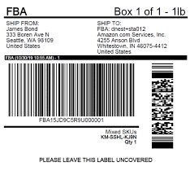

# 📦 QR Code & Barcode Detector with Python

Detect barcodes and QR codes in any image using Python, OpenCV, and Pyzbar.



## 🚀 Features

✅ Detects **QR Codes** and **Barcodes**  
✅ Draws bounding boxes on detected codes  
✅ Prints decoded text (type + content)  
✅ Uses OpenCV & Pyzbar for accuracy  

## 🧪 Sample Output


---

## 📂 Files in This Repo

| File                      | Description                                   |
|---------------------------|-----------------------------------------------|
| `barcode_qrcode_detector.py` | Python script to detect and draw bounding boxes |
| `input_image.jpg`         | Sample input image (you can replace with your own) |
| `requirements.txt`        | List of required Python packages              |

---

## ⚙️ Installation

Install the required packages before running:

```bash
pip install opencv-python pyzbar numpy

### ✅ What To Do Next

1. Go to your repo  
2. Click **Add File → Create new file**  
3. Name it `README.md`  
4. Paste this full content above  
5. Commit it — and you’re done 🔥

Want me to insert **your real name**, **GitHub profile**, or a **custom QR image preview** in the README? Just drop your info here and I’ll plug it in perfectly.
